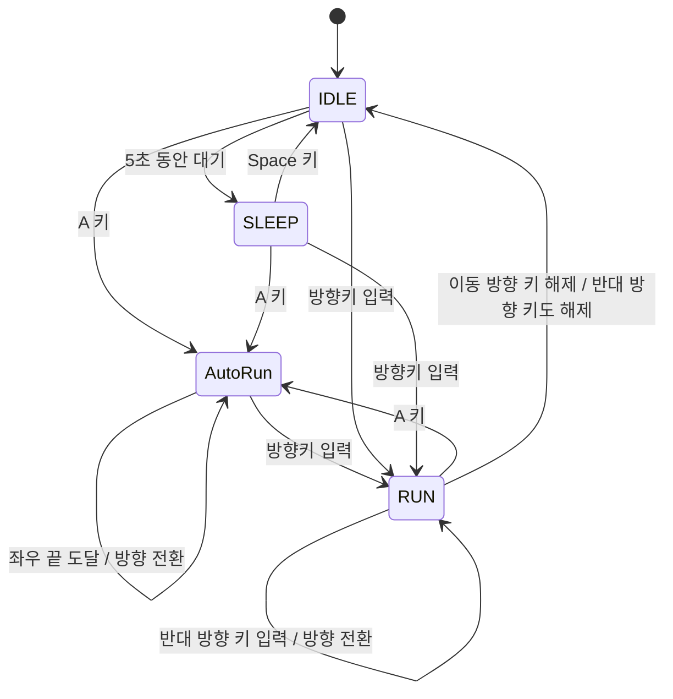

1. a키를 누르면 AutoRun상태 진입
2. 자동으로 키 조작 없이 좌우로 계속 이동함
3. AutoRun 에서는 속도가 더 빠르고 좌우측 끝에서 자동 방향 전환이 되며 움직임
4. 이때 방향키 입력이 들어오면 기존 RUN 상태로 돌아간다.

## 상태 다이어그램

```mermaid
stateDiagram-v2
    [*] --> IDLE

    IDLE --> AutoRun: A 키
    RUN --> AutoRun: A 키
    SLEEP --> AutoRun: A 키
    AutoRun --> AutoRun: 좌우 끝 도달 / 방향 전환
    AutoRun --> RUN: 방향키 입력

    IDLE --> RUN: 방향키 입력
    IDLE --> SLEEP: 5초 동안 대기
    RUN --> IDLE: 이동 방향 키 해제 / 반대 방향 키도 해제
    RUN --> RUN: 반대 방향 키 입력 / 방향 전환
    SLEEP --> IDLE: Space 키
    SLEEP --> RUN: 방향키 입력
```